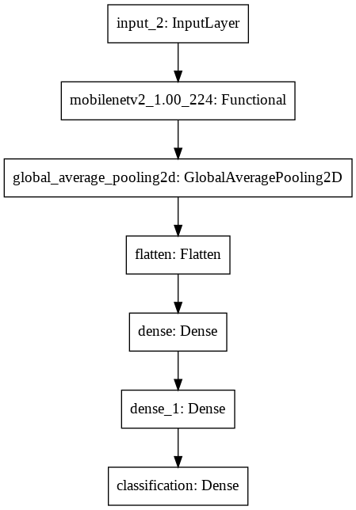
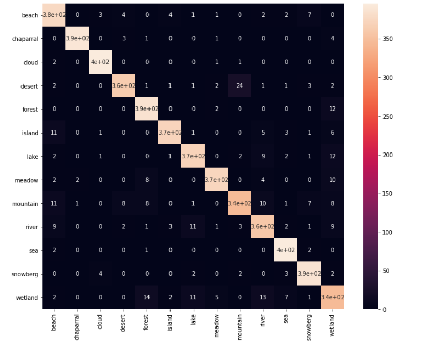
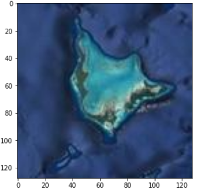
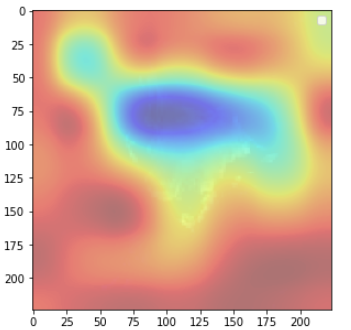

Go through the challenge website and watch the trailer video.

#### Question 1: Briefly explain the problem.

#### Question 2: What is the scoring metric used to evaluate submissions?
#### Question 4: what does the confusion matrix represent?
#### Question 5: Why is there a standard deviation associated with the cross-validation score?

The code was developed based on Starting Kit provided Areal Team. 

# Aerial-Image-Recognition
The competition is hosted on https://competitions.codalab.org/competitions/27749#learn_the_details-overview

The data set contains 9100 color images of size 128 x 128, images of 13 class, each having 700 images.
The classes are some kind of landscape or a natural environment, and more specifically :
beach, chaparral, cloud, desert, forest, island, lake, meadow, mountain, river, sea_ice, snowberg, wetland.

The goal of this challenge will be to classify each image and assign to it the correct label.

### Model Structure

### Experiment Tracking by Neptune

Check the following Link: 

https://ui.neptune.ai/xiaoya27/AerialImageClassification/experiments?viewId=standard-view

### Result

Class Activation Maps

Original            |  CAM
:-------------------------:|:-------------------------:
  |  
